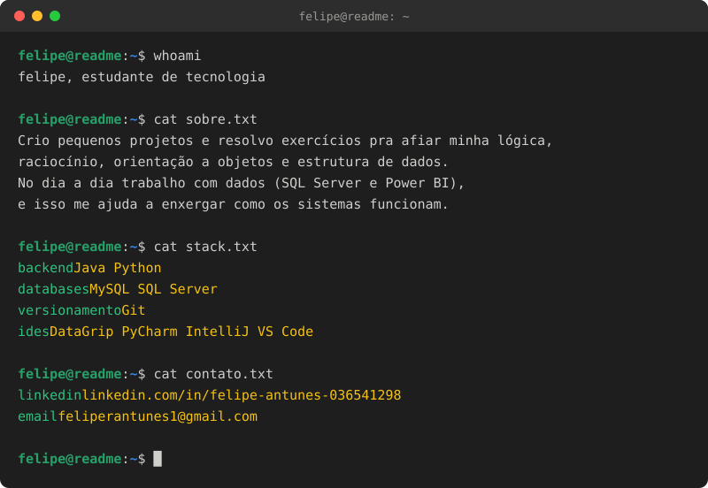

  

  <a href="https://www.linkedin.com/in/felipe-antunes-036541298/" target="_blank">
    
    LinkedIn
  </a>
  &nbsp;&nbsp;·&nbsp;&nbsp;
  <a href="mailto:feliperantunes1@gmail.com">
    
    E-mail
  </a>

<!--
**feliperantunes/feliperantunes** is a ✨ _special_ ✨ repository because its `README.md` (this file) appears on your GitHub profile.

Here are some ideas to get you started:

- 🔭 I’m currently working on ...
- 🌱 I’m currently learning ...
- 👯 I’m looking to collaborate on ...
- 🤔 I’m looking for help with ...
- 💬 Ask me about ...
- 📫 How to reach me: ...
- 😄 Pronouns: ...
- ⚡ Fun fact: ...
-->
